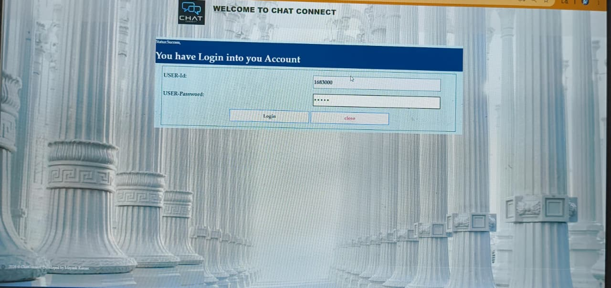
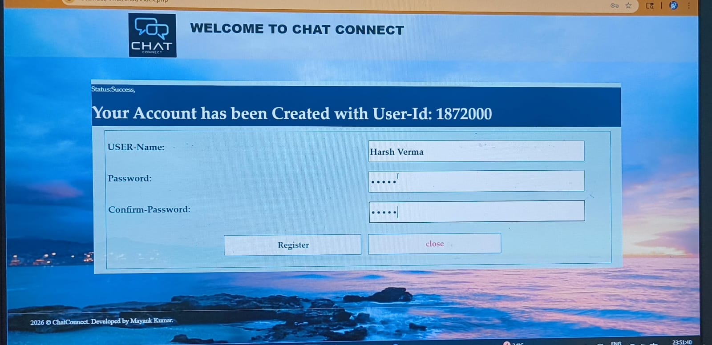
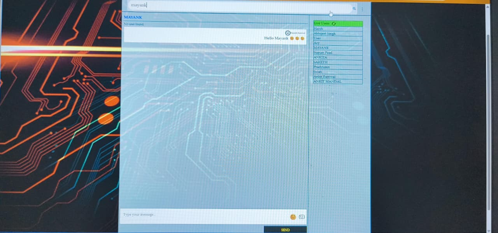
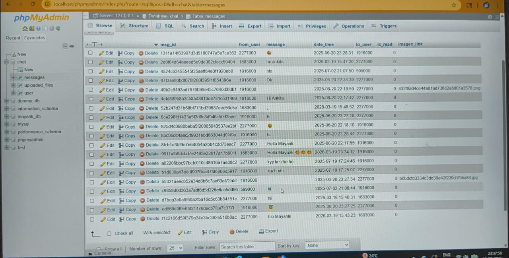
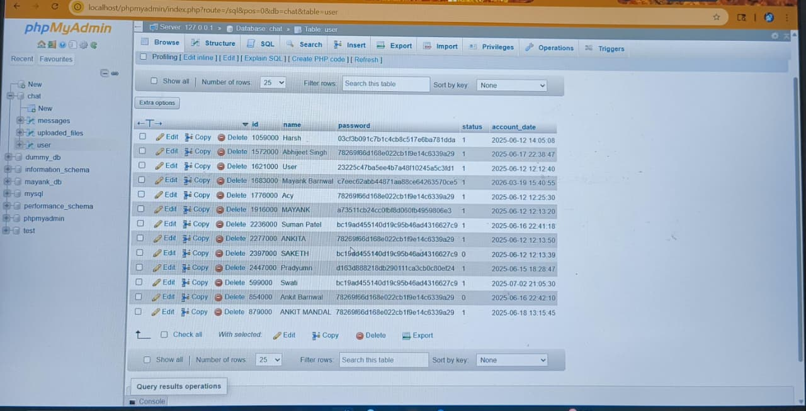

# 💬 Chat Connect

A full-stack multi-user real-time chat application built using PHP, MySQL, HTML/CSS, JavaScript, and jQuery. This project allows users to communicate seamlessly through a secure and interactive platform.

---

## 🚀 Features

- 🔐 User Registration & Login (Session Management)
- 🧑‍🤝‍🧑 Real-time Active User List
- 💬 One-to-One Private Messaging
- 🔍 Search Users Functionality
- 😊 Emoji Support for Chat
- 🕒 Messages with Timestamps
- 📱 Responsive UI (Mobile Friendly)
- ⚙️ Personal Dashboard (Profile, Settings)

---

## 🛠 Tech Stack

- **Frontend:** HTML, CSS, JavaScript, jQuery  
- **Backend:** PHP  
- **Database:** MySQL  
- **Server:** XAMPP (Localhost)

---

### 🔹 UI Screens
  
  
  

---

### 🔹 Database
  
  

---

## ⚙️ How to Run Locally

1. Install XAMPP  
2. Start **Apache** and **MySQL**  
3. Copy project folder to `htdocs`  
4. Import database in **phpMyAdmin**  
5. Open browser and go to:

---

## 💡 Future Improvements

- ✍️ Typing Indicator  
- ✔️ Seen/Delivered Status  
- 📁 Media Sharing (Images, Docs)  
- 👥 Group Chat Functionality  

---

## 👨‍💻 Author

**Mayank Kumar**  
📧 mayankbarnwal72@gmail.com  
🔗 LinkedIn: https://www.linkedin.com/in/mayank-kumar-5b3171290/  
💻 GitHub: https://github.com/Mayank934j  

---

## ⭐ Show Your Support

If you like this project, please give it a ⭐ on GitHub!
